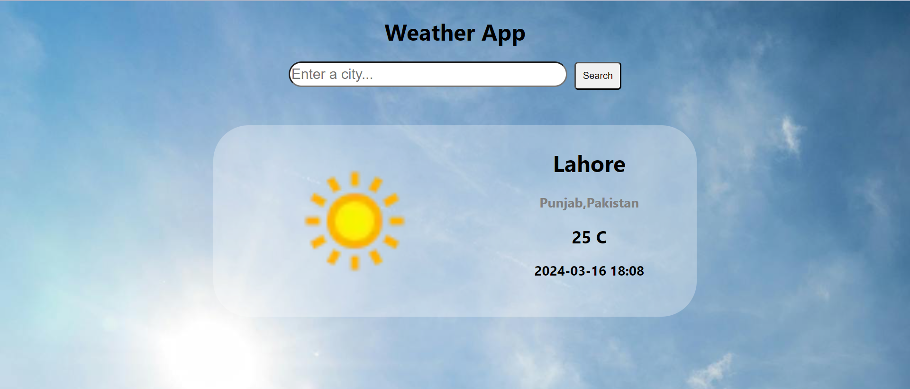

# Weather App

This project is build using Reactjs and ContextApi.

## Features

- The app automatically gets the user location by latitudes and longitudes and fetches data based on the current location.
- The App also tells the Weather condition of the city that is entered.

## Live website

[Weather App](https://weather-app-eight-delta-32.vercel.app/)

## Preview

